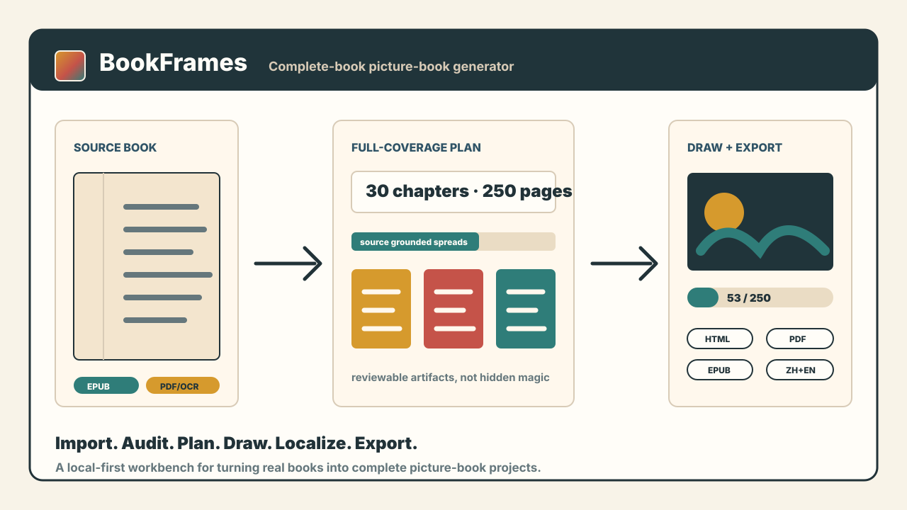
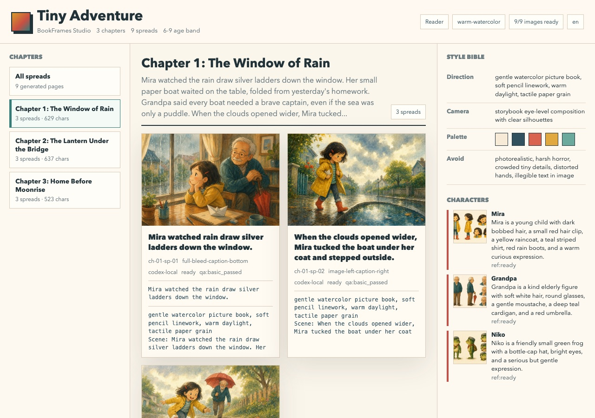

# BookFrames

Turn a book into a complete, inspectable picture-book project.



A book should not become six random images.

BookFrames turns source books into complete, reviewable picture-book projects: import the source, audit the extraction, plan every chapter, ground every spread in source text, localize captions, draw images, and export a reader, print view, PDF, and EPUB.

The core product bet is simple: beautiful output only matters if the whole chain is reviewable.

## Actual Run

These are not mockups. They are real outputs from the included `examples/tiny-adventure.txt` demo after a local Codex image run.


| Generated spread | Inspectable Studio |
| --- | --- |
|  |  |

## Why It Exists

Most AI picture-book tools collapse a source book into a handful of pretty scenes. That is fine for a demo and useless for a real book.

BookFrames is built for the opposite workflow:

- Complete-book coverage by default with `full-coverage` planning.
- Source-grounded spreads with excerpts and traceability.
- Local review artifacts for OCR, chapter splitting, story planning, characters, captions, and images.
- A browser workbench that shows import quality, page plan, drawing queue, change requests, and exports in one place.
- A no-API-key local Codex image path, plus an optional OpenAI image API provider.
- Caption localization that can change subtitles and exports without redrawing images.

## What You Get

```txt
source book
  -> text / PDF / OCR / MinerU import
  -> import audit and chapter map
  -> full-coverage page plan
  -> source-grounded captions and image prompts
  -> local Codex or API image generation
  -> reader HTML, studio HTML, print HTML, review PDF, EPUB
```

Every stage writes files. You can inspect, edit, resume, or replace any part of the pipeline.

## Quick Start

Requires Node.js 20+.

```bash
npm test
npm run demo
npm run web
```

Open:

```txt
http://127.0.0.1:4197/apps/web/
```

The demo creates a tiny local project under `runs/tiny-adventure/`. The `runs/` directory is intentionally ignored by git.

## Create a Book

```bash
node apps/cli/index.js create ~/Books/story.epub \
  --out runs/story \
  --title "Story" \
  --language zh-en \
  --spreads-per-chapter full-coverage
```

Useful commands:

```bash
node apps/cli/index.js lint runs/story
node apps/cli/index.js inspect runs/story
node apps/cli/index.js render runs/story --image-provider codex-local
node apps/cli/index.js codex-jobs runs/story --limit 8
node apps/cli/index.js export runs/story
```

For a scanned or layout-heavy PDF:

```bash
node apps/cli/index.js create ~/Books/scanned.pdf \
  --out runs/scanned-story \
  --pdf-engine mineru-hybrid \
  --mineru-lang ch \
  --language zh-en \
  --spreads-per-chapter full-coverage
```

## Workbench

The workbench is the product surface:

```bash
npm run web
```

Open:

```txt
http://127.0.0.1:4197/apps/web/
```

It supports:

- Uploading EPUB, PDF, TXT, and Markdown book sources.
- Full-coverage import and drawing by default.
- Import-quality review before drawing.
- Chapter and spread inspection.
- Local Codex image queue progress.
- Pause-ready persisted image runs under `runs/_image-runs/`.
- Change requests that write Codex-ready prompts under `runs/_change-requests/`.
- Caption conversion such as `中文 + English` without redrawing images.
- Export refresh for reader, print, PDF, and EPUB.

## Caption-Only Localization

Use the workbench export panel or call the API route:

```txt
POST /api/captions/language
```

BookFrames updates caption localization fields and export artifacts only. Existing `assets/images/` are preserved.

## Local Codex Images

The default local drawing path does not require `OPENAI_API_KEY`.

```bash
node apps/cli/index.js render runs/story --image-provider codex-local
node apps/cli/index.js next-queue-prompt runs/story
node apps/cli/index.js import-queue runs/story --limit 3
```

In the workbench:

- `复制下一张 Prompt` hands the next queue item to the current Codex chat.
- `本地 Codex 生成 1 张` starts a persisted one-page image run.
- `自动绘制整本` starts a persisted full-book image run.

If Codex CLI auth expires, run:

```bash
codex login --device-auth
```

Then start a new full-book image run. Already completed images remain in the project and are skipped.

## Optional API Images

```bash
OPENAI_API_KEY=... node apps/cli/index.js generate-openai runs/story --limit 1
```

The API-backed route remains available for automation, but it is not required for the default local workflow.

## PDF and OCR

PDF engines:

- `auto`: native extraction first, then stronger local paths when needed.
- `native`: searchable PDF text only.
- `mineru-pipeline`: faster MinerU pipeline path.
- `mineru-vlm`: heavy VLM path for difficult scans.
- `mineru-hybrid`: preferred high-precision path when local MinerU is installed.

BookFrames writes these audit artifacts:

- `source/extracted.txt`
- `source/ingest-report.json`
- `source/page-audit.json`
- `source/import-quality.json`
- `source/chapter-map.json`
- `planning/story-arc.json`
- `planning/planning-review.json`
- `planning/character-review.json`

## Project Shape

```txt
apps/cli             agent-friendly commands
apps/web             local browser workbench and API server
packages/core        schema, ids, lint, project IO
packages/ingest      text/PDF/OCR/MinerU import
packages/page-plan   fixed, auto, and full-coverage planning
packages/planner     story, spread, caption, character, prompt planning
packages/image       placeholder and Codex-local image bridge
packages/layout      static reader and studio renderer
packages/export      print HTML, PDF, and EPUB exporter
packages/producer    orchestration pipeline
```

## Design Principles

- Complete books, not teaser decks.
- Inspectable stages, not black boxes.
- Local-first by default.
- Source traceability over generic visual polish.
- Restartable drawing queues.
- Honest warnings when OCR, localization, or generation is weak.

## Repository Hygiene

This repository intentionally ignores:

- `runs/`
- `inputs/`
- `.venv*/`
- uploaded books and generated exports

Keep real books, generated images, local model artifacts, and private run logs out of commits.

## License

MIT
